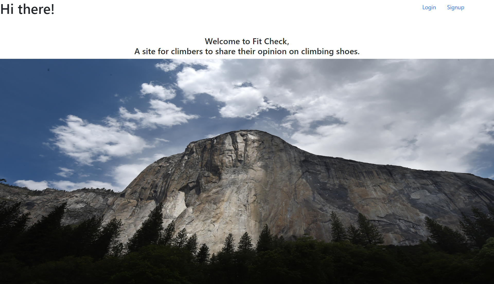
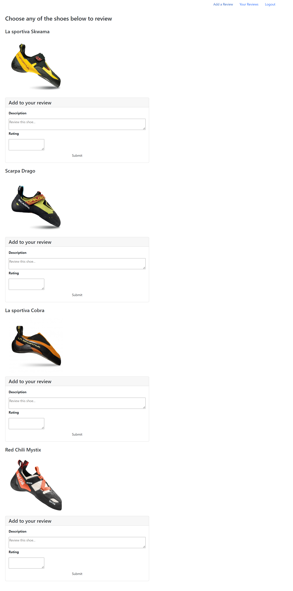
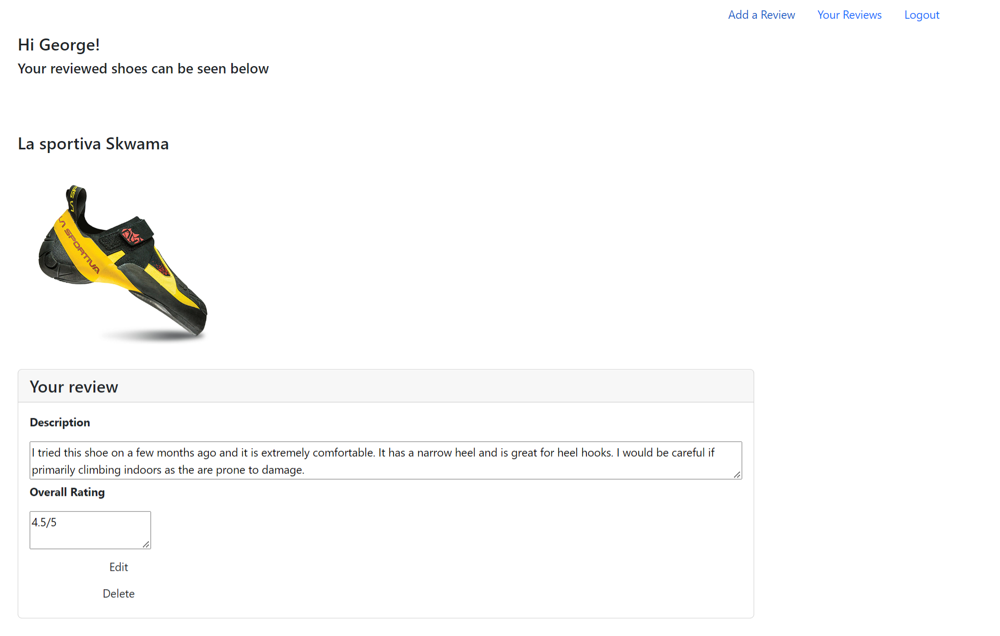

<h2>
Description
</h2>

The purpose of this project was to create a web application where the user can create  
a profile by signing up and then go on to view other user reviews and create reviews of their own. 
When the user loads the application they will see a landing page asking them to either login or signup 
Once signed in, the user will see that the navigation bar changes to provide them with new options as seen below. 

When the user makes their way through the navigation bar they will find their profile and a page where they can create reviews

<h2>
Challanges
</h2>

There were a lot of things that I found very difficult including linking the front to back end as well as managing forms. 
As a result much of the customer facing forms are not yet functional and will have to be corrected in future development.
